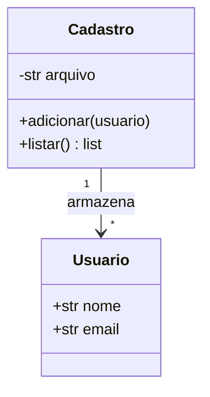

# Diagrama de Classes

```mermaid
classDiagram
    class Usuario {
        +str nome
        +str email
    }
    class Cadastro {
        -str arquivo
        +adicionar(usuario)
        +listar() list
    }
    Cadastro "1" --> "*" Usuario : armazena
```
